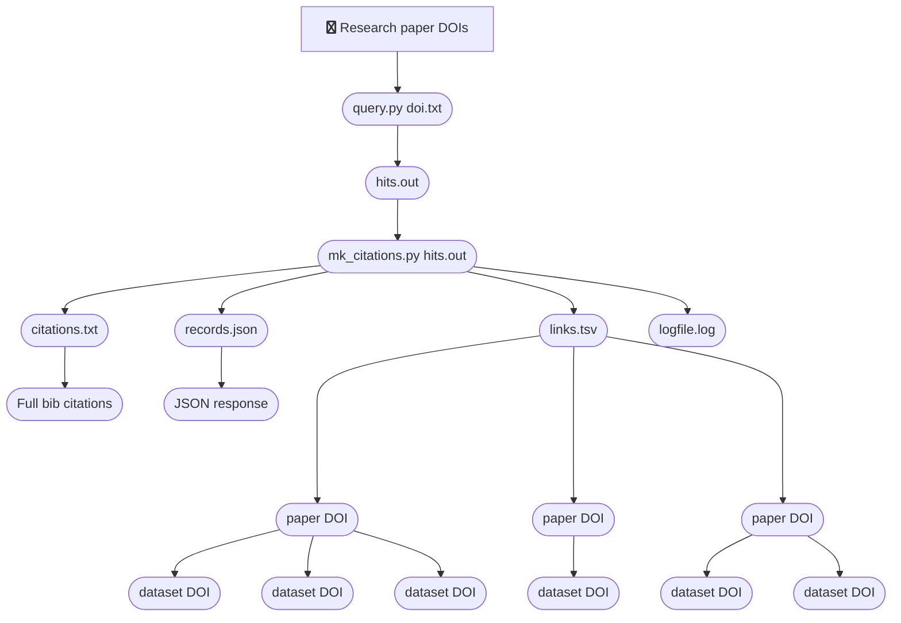

# Find links between research outputs and research data in other data repositories

## Requirements
You must install the 3rd party module: requests  
Full details: https://pypi.org/project/requests/

You will need a list of DOIs for research papers from your institutional repository.
This list is the input file for the *Query* script.

## Licence
Code written by N Syrotiuk licenced under CC-BY.

## API documentation
http://scholexplorer.openaire.eu/

## Query Scholix API script: **query.py**
The script takes one command line parameter; namely, a file containing DOIs of research papers, one DOI per line.

The script makes one API call for every DOI in the input file.  If a DOI has one or more links to other research outputs then it writes the DOI to the output file.  At this stage the material type of the research output a DOI links to is not checked.  The material type could be either 'literature' or 'dataset'.

Execute script
> python3 query.py oneDOI.txt

Output file: **hits.out**  
10.1002/anie.201804488 

The example input file here contains one DOI only.  This makes the README documentation more comprehensible.  In practice you will have thousands of DOIs in the input file.

## Make citations: **mk_citations.py**
Like query.py, this script makes one API call for every DOI in the input file.  Now the material type is checked.  Two output files (links.tsv and citations.txt) only include DOIs of research papers if they link to dataset DOIs.

Execute script
> python3 mk_citations.py3 hits.out

The script creates four output files:
- links.tsv
- citations.txt
- records.json
- logfile.log

Output file: **links.tsv**

File format is:  
*DOI\tDATA-DOI\tDATA-DOI\tDATA-DOI...* where \t represents a tab character

For example:
10.1002/anie.201804488	10.5517/ccdc.csd.cc1plxx3	10.5517/ccdc.csd.cc1plxy4

In this example, the research paper (10.1002/anie.201804488) has two corresponding research datasets (10.5517/ccdc.csd.cc1plxx3 and 10.5517/ccdc.csd.cc1plxy4)

The file may contain data DOIs pointing to the local research data repository.  If so, you might want to remove the lines containing LOCAL DATA REPOSITORY:
>grep -v LOCAL links.tsv > linksWithoutLocalDataRepository.tsv

Output file: **citations.txt**  [lines appear to wrap here but do not wrap in the file]

>Gimenez, Diana ; Aguilar, Juan A. ; Bromley, Elizabeth H. C. ; Cobb, Steven L.  (2018):  CCDC 1567326: Experimental Crystal Structure Determination.  Cambridge Crystallographic Data Centre.  [dataset]  DOI: http://doi.org/10.5517/ccdc.csd.cc1plxx3

>Gimenez, Diana ; Aguilar, Juan A. ; Bromley, Elizabeth H. C. ; Cobb, Steven L.  (2018):  CCDC 1567327: Experimental Crystal Structure Determination.  Cambridge Crystallographic Data Centre.  [dataset]  DOI: http://doi.org/10.5517/ccdc.csd.cc1plxy4

Output file: **records.json**

This file contains the JSON response from the Scholix API.

Output file: **logfile.log**  
Processing doi 10.1002/anie.201804488........found dataset!........found dataset!

## Post data: post_data.py
The script illustrates how you might post JSON data to a repository API.  This particular script is designed to call a Sufia/Hydra/Samvera/Hyrax API only.

The Sufia/Hydra API has been customised in two ways:
1. The API accepts JSON data without depositing a research dataset
2. The API allows HTTP basic authentication by repository admin users only

### What this script does:
For each research paper DOI, create one deposit record in the local data repository.  The record will contain all research data DOIs associated with the research paper.

The script has been successfuly tested with Sufia/Hydra v.6.3.0.

Execute the script:
> python3 post_data.py3 hits.out  
>  
> Enter username: pzvx49  
> Enter password (N.B.: you will *not* see any input as you type):   
>  
> ##########......##########  
> #########  1  ##########  
> #########......##########  
>  
>  Processing doi 10.1111/ecog.02712  
>  /usr/local/lib/python2.7/dist-packages/urllib3/connectionpool.py:851: InsecureRequestWarning: Unverified HTTPS request is being made. Adding certificate verification is strongly advised. See: https://urllib3.readthedocs.io/en/latest/advanced-usage.html#ssl-warnings InsecureRequestWarning)  
>  
>  Response from https://collections-test.durham.ac.uk/files  
>  ok posting data  

